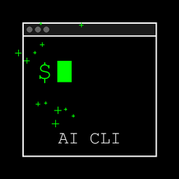
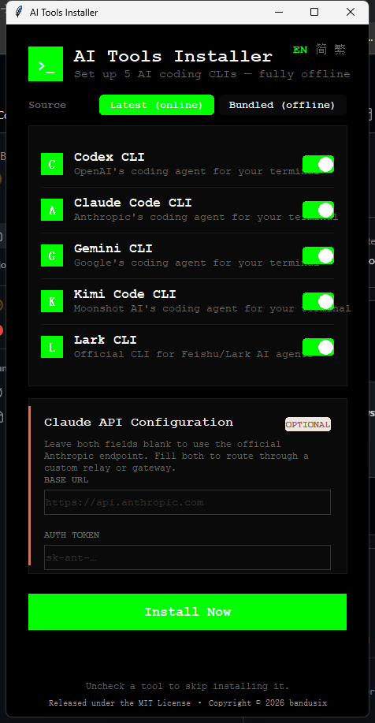
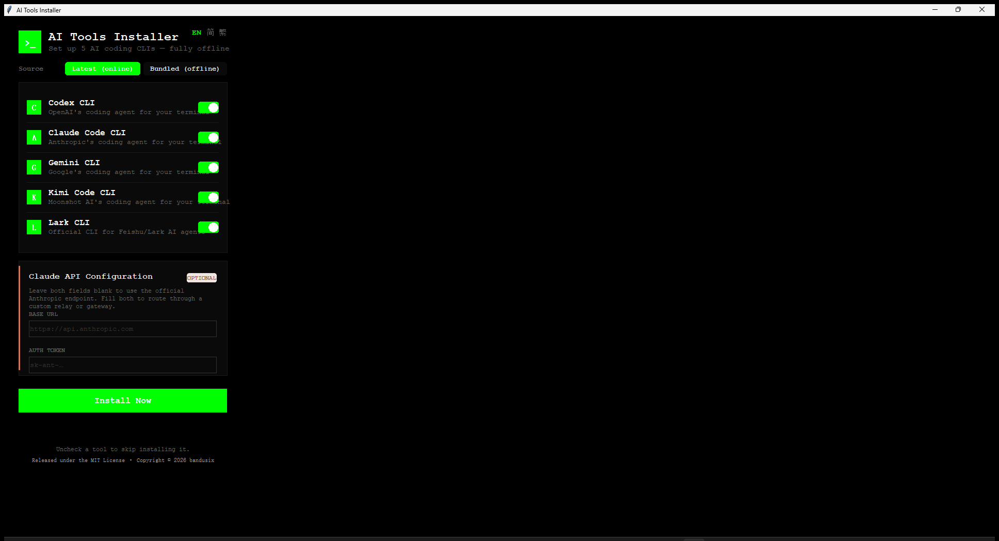

# Easy AI CLI Installer
*Created by **[bandusix](https://github.com/bandusix)** | Fork with Claude API relay + online source support*

<p align="center">
  
</p>

[](LICENSE)
[](https://github.com/bandusix/easy-ai-cli-installer/actions)

🌍 *[English](#english-version) | [中文](#中文版)*

---

## 中文版

一个傻瓜式、一键执行的 GUI 安装工具,专为在 macOS 和 Windows 上实现 **5 款主流 AI 编程 CLI** 的**完全离线、零配置**安装而设计:Codex CLI、Claude Code CLI、Gemini CLI、Kimi Code CLI、飞书 CLI。

**本 fork 在 [upstream](https://github.com/bandusix/easy-codex-and-claude-cli-setup) 基础上新增两大功能:**
1. **Claude API 中转配置** — 在 GUI 里填写自定义 Base URL + Token,安装器会把这两个环境变量写入 `claude` 命令的 wrapper,其他命令和系统环境不受影响
2. **在线拉取最新版本** — GUI 顶部新增 **Source 切换器**,可选 **Latest (online)** 从 npm/GitHub 直接拉最新 release,或保留原有的 **Bundled (offline)** 用离线 payload

<p align="center">
  
</p>

### 🚀 核心特性
- **一键覆盖 5 款工具**:Codex CLI(OpenAI)、Claude Code CLI(Anthropic)、Gemini CLI(Google)、Kimi Code CLI(Moonshot AI)、飞书 CLI(官方 `@larksuite/cli`),逐个勾选按需安装
- **真正的跨平台**:原生支持 macOS (Apple Silicon M1/M2/M3) 以及 Windows (x64)
- **100% 纯离线安装包(Bundled 模式)**:所有 Node.js 运行时、各工具的 npm 离线包、以及 Codex / 飞书 CLI 的官方预编译二进制文件,均已全数打包进单个可执行文件中。**安装全程无需任何网络连接,告别网络报错!**
- **Latest 模式(联网自动更新)**:切换到 Latest 后,安装器会从 npm registry 和 GitHub Releases 拉取每个 CLI 的最新版本,无需等 installer 更新
- **Claude API 中转支持**:在界面上填 Base URL 和 Token,只对 `claude` 命令生效,其他命令和系统环境变量不受污染
- **现代化原生质感界面**:Windows 端采用 Fluent Design 视觉语言,macOS 端采用原生 macOS 设计规范,圆角卡片、开关组件均为精细手绘渲染,告别老旧的 Tkinter 默认外观
- **三语言界面,自动适配**:内置英文 / 简体中文 / 繁體中文,安装器会根据系统语言自动切换(台湾、香港、澳门用户自动显示繁体),也可在右上角随时手动切换
- **零配置体验**:自动管理系统环境变量(PATH),自动建立软链接和环境隔离目录,绝对不会污染你的系统全局包

### 📥 下载与小白使用教程

无论你是技术小白还是老手,只需 1 分钟即可完成安装。请前往 [Releases](https://github.com/bandusix/easy-ai-cli-installer/releases) 页面下载最新版本。

#### 🍏 macOS 用户
1. 下载 `AI_Tools_Installer_macOS_arm64.dmg` 文件(Apple Silicon M 系列芯片)。
2. 双击打开 `.dmg` 文件,会弹出一个包含 `AI Tools Installer.app` 的窗口。
3. 双击运行 `AI Tools Installer.app`(如果系统提示"无法打开",**右键点击 .app → 选择"打开"** → 在弹出的对话框中点击"打开")。
4. 在弹出的可视化界面中:
   - **右上角可切换界面语言**
   - **顶部 Source 切换**:Latest (online) 联网拉最新版 | Bundled (offline) 用离线包
   - **勾选你需要安装的工具**
   - **(可选)如果安装 Claude Code 且要用中转,展开 "Claude API Configuration" 卡片,填写 Base URL 和 Token**
   - 点击 **Install Now / 立即安装**
5. **安装完成后,请彻底关闭并重新打开你的终端(Terminal 或 iTerm2)**。
6. 在终端输入 `codex`、`claude`、`gemini`、`kimi` 或 `lark-cli` 即可直接开始使用!

#### 🪟 Windows 用户
1. 下载 `AI_Tools_Installer_Windows.exe` 文件。
2. 双击运行该 `.exe` 文件(如果 Windows Defender 弹出拦截提示,请点击"更多信息" → "仍要运行")。
3. 在弹出的可视化界面中:
   - **右上角可切换界面语言**
   - **顶部 Source 切换**:Latest (online) 联网拉最新版 | Bundled (offline) 用离线包
   - **勾选你需要安装的工具**
   - **(可选)如果安装 Claude Code 且要用中转,展开 "Claude API Configuration" 卡片,填写 Base URL 和 Token**
   - 点击 **Install Now / 立即安装**
4. **安装完成后,请彻底关闭并重新打开你的命令提示符(CMD)或 PowerShell**。
5. 在终端输入 `codex`、`claude`、`gemini`、`kimi` 或 `lark-cli` 即可直接开始使用!

### ❓ 常见问题 (FAQ)

<details>
<summary><b>Q: Source: Latest 和 Bundled 有什么区别?</b></summary>

- **Latest (online)**:安装时联网从 npm registry 和 GitHub Releases 拉取最新版本。优点:总是最新;缺点:需要网络,首次下载慢(~100MB)
- **Bundled (offline)**:使用打包在 installer 里的离线版本。优点:完全离线,秒装;缺点:版本固定在 installer 打包时的版本

**推荐**:如果网络稳定,选 Latest;如果在内网或网络不好,选 Bundled。
</details>

<details>
<summary><b>Q: Claude API Configuration 是做什么的?</b></summary>

如果你有自己的 Claude API 中转服务(例如公司内网网关、第三方代理),可以在这里填:
- **Base URL**:中转服务的 API endpoint,例如 `https://api.mycompany.com/anthropic`
- **Auth Token**:中转服务要求的鉴权 token

填写后,安装器会把这两个值写入 `claude` 命令的启动脚本,**只对 `claude` 生效**,不会影响其他 CLI 或系统环境变量。

如果你用官方 Anthropic API,**留空即可**。
</details>

<details>
<summary><b>Q: 为什么 macOS 只有 Apple Silicon 版本,没有 Intel 版本?</b></summary>

GitHub 托管的 Intel runner (macos-13) 正在被弃用,排队时间长达 30+ 分钟,且磁盘空间不足导致构建失败率高。Apple Silicon 已经是 macOS 主流(2020 年后的 Mac),Intel 用户可以通过 Rosetta 2 运行 Apple Silicon 版本,性能差异不大。

如果你确实需要 Intel 原生构建,可以 clone 本仓库,在本地运行 `pyinstaller build.spec` 自行打包。
</details>

<details>
<summary><b>Q: 安装完成后输入命令提示"找不到命令"?</b></summary>

请确保:
1. **完全关闭并重新打开终端**:环境变量(PATH)只在新打开的终端会话中生效
2. 检查安装器是否报错:如果中途失败,命令不会被安装
3. macOS 用户:检查 `~/.zshrc` 或 `~/.bash_profile` 末尾是否有类似 `export PATH="$HOME/.ai-tools/bin:$PATH"` 的行
4. Windows 用户:在 PowerShell 里运行 `$env:PATH` 检查是否包含 `%USERPROFILE%\.ai-tools\bin`
</details>

<details>
<summary><b>Q: 我可以卸载吗?</b></summary>

可以。CLI 和 Node.js runtime 都安装在 `~/.ai-tools/`(macOS/Linux)或 `%USERPROFILE%\.ai-tools\`(Windows)目录下,直接删除该目录即可。

环境变量需要手动清理:
- **macOS**:编辑 `~/.zshrc` 或 `~/.bash_profile`,删除包含 `.ai-tools/bin` 的那行
- **Windows**:在"系统属性 → 环境变量"里删除用户 PATH 中的 `.ai-tools\bin` 路径
</details>

### 🛠️ 开发者说明 (原理)

本项目的核心是依托 **GitHub Actions** 自动化完成了繁重的跨平台封装:
1. **每天 UTC 04:00 定时检测**:运行 `scripts/fetch_latest.py --check`,探测 npm registry 和 GitHub Releases 的最新版本
2. **有更新就自动重打包**:下载最新的 npm tarball、Codex/Lark 二进制、Node.js runtime,放入 `payload/` 目录
3. **PyInstaller 打包**:使用 `build.spec` 把 `gui_installer.py` + `payload/` 打成单文件可执行程序
4. **自动发 Release**:把 `.exe` 和 `.zip` 上传到 GitHub Releases,tag 为 `installer-<run_number>-<repo>`

飞书 CLI 官方包的 `postinstall` 脚本本身会联网下载其 Go 二进制,为保证离线安装,改为跳过该脚本,直接把 CI 阶段下载好的二进制放到其启动器期望的路径。

GUI 本身通过 Tkinter Canvas 手绘实现平台特定的现代化视觉风格与多语言文案。

**如何本地构建:**
```bash
# 1. 下载所有 payload(需联网)
python scripts/fetch_latest.py --download

# 2. 打包(输出到 dist/)
pip install pyinstaller
pyinstaller build.spec --clean

# 3. 产物
# macOS → dist/AI_Tools_Installer.app
# Windows → dist/AI_Tools_Installer.exe
```

---

## English Version

A foolproof, one-click GUI installer designed to set up **5 popular AI coding CLIs** across macOS and Windows with absolute zero configuration and **fully offline** capability: Codex CLI, Claude Code CLI, Gemini CLI, Kimi Code CLI, and Lark/Feishu CLI.

**This fork adds two new features on top of [upstream](https://github.com/bandusix/easy-codex-and-claude-cli-setup):**
1. **Claude API Relay Configuration** — Fill in a custom Base URL + Token in the GUI, and the installer writes them into a wrapper script for the `claude` command only (other commands and system environment unaffected)
2. **Online Latest Source** — A new **Source toggle** at the top of the GUI lets you choose **Latest (online)** to fetch the newest releases from npm/GitHub directly, or keep the original **Bundled (offline)** behavior with the packaged payload

<p align="center">
  
</p>

### 🚀 Features
- **5 tools in one click**: Codex CLI (OpenAI), Claude Code CLI (Anthropic), Gemini CLI (Google), Kimi Code CLI (Moonshot AI), and Lark/Feishu CLI (official `@larksuite/cli`) — toggle each on or off as you like
- **True Cross-Platform**: Natively supports macOS (Apple Silicon M1/M2/M3) and Windows (x64)
- **100% Offline Payload (Bundled mode)**: Bundles the Node.js runtime, each tool's npm package, and official pre-compiled binaries for Codex and Lark CLI into a single executable. No network issues during installation!
- **Latest mode (online auto-update)**: Switch to Latest to have the installer fetch the newest version of every CLI from npm registry and GitHub Releases, no need to wait for installer updates
- **Claude API relay support**: Fill in Base URL and Token in the UI; only affects the `claude` command, leaving other commands and system environment unpolluted
- **Modern, Platform-Native UI**: Fluent Design styling on Windows, macOS-native styling on macOS — rounded cards and toggle switches hand-drawn on canvas, no more dated default Tkinter look
- **Trilingual, Auto-Detected**: Ships with English / Simplified Chinese / Traditional Chinese. The installer auto-switches based on your system locale (Traditional Chinese for Taiwan/Hong Kong/Macau users), with a manual switcher in the top-right corner
- **Zero Config**: Automatically manages PATH environments, symbolic links, and isolated directories without polluting your global system packages

### 📥 Download & Beginner's Guide

Install everything in just 1 minute, no technical knowledge required. Head over to the [Releases](https://github.com/bandusix/easy-ai-cli-installer/releases) page to download the latest version.

#### 🍏 macOS Users
1. Download the `AI_Tools_Installer_macOS_arm64.dmg` file (for Apple Silicon M-series chips).
2. Double-click the `.dmg` file to mount it, you will see a window with `AI Tools Installer.app`.
3. Double-click `AI Tools Installer.app` to run it (If macOS blocks it with "cannot be opened", **right-click the .app → choose "Open"** → in the pop-up dialog, click "Open").
4. In the pop-up GUI:
   - **Switch display language from the top-right corner**
   - **Source toggle at top**: Latest (online) fetches newest | Bundled (offline) uses packaged
   - **Select the tools you want**
   - **(Optional) If installing Claude Code with a relay, expand the "Claude API Configuration" card and fill in Base URL + Token**
   - Click **Install Now**
5. **Once finished, completely close and reopen your Terminal or iTerm2.**
6. Type `codex`, `claude`, `gemini`, `kimi`, or `lark-cli` to start using whichever tools you installed!

#### 🪟 Windows Users
1. Download the `AI_Tools_Installer_Windows.exe` file.
2. Double-click to run it (If Windows Defender pops up, click "More info" → "Run anyway").
3. In the pop-up GUI:
   - **Switch display language from the top-right corner**
   - **Source toggle at top**: Latest (online) fetches newest | Bundled (offline) uses packaged
   - **Select the tools you want**
   - **(Optional) If installing Claude Code with a relay, expand the "Claude API Configuration" card and fill in Base URL + Token**
   - Click **Install Now**
4. **Once finished, completely close and reopen your Command Prompt (CMD) or PowerShell.**
5. Type `codex`, `claude`, `gemini`, `kimi`, or `lark-cli` to start using whichever tools you installed!

### ❓ FAQ

<details>
<summary><b>Q: What's the difference between Source: Latest and Bundled?</b></summary>

- **Latest (online)**: Fetches the newest version from npm registry and GitHub Releases at install time. Pros: always up-to-date. Cons: requires network, first download is slow (~100MB)
- **Bundled (offline)**: Uses the versions packaged inside the installer. Pros: completely offline, instant install. Cons: versions are fixed at the time the installer was built

**Recommendation**: Use Latest if your network is stable; use Bundled if you're on an intranet or have unreliable connectivity.
</details>

<details>
<summary><b>Q: What is Claude API Configuration for?</b></summary>

If you have your own Claude API relay service (e.g., a company internal gateway, third-party proxy), fill in:
- **Base URL**: The relay service's API endpoint, e.g., `https://api.mycompany.com/anthropic`
- **Auth Token**: The auth token required by the relay service

After filling these in, the installer writes them into the `claude` command's launch script, **affecting only `claude`**, not other CLIs or system environment variables.

If you use the official Anthropic API, **leave both fields blank**.
</details>

<details>
<summary><b>Q: Why is there only an Apple Silicon macOS version, no Intel version?</b></summary>

GitHub's hosted Intel runner (macos-13) is being deprecated, with queue times exceeding 30+ minutes and frequent build failures due to insufficient disk space. Apple Silicon has been the macOS mainstream since 2020, and Intel users can run the Apple Silicon version via Rosetta 2 with minimal performance difference.

If you need a native Intel build, clone this repo and run `pyinstaller build.spec` locally.
</details>

<details>
<summary><b>Q: After installation, typing the command says "command not found"?</b></summary>

Make sure:
1. **Completely close and reopen your terminal**: Environment variables (PATH) only take effect in newly opened terminal sessions
2. Check if the installer reported errors: If it failed mid-way, the commands won't be installed
3. macOS users: Check if `~/.zshrc` or `~/.bash_profile` has a line like `export PATH="$HOME/.ai-tools/bin:$PATH"` at the end
4. Windows users: Run `$env:PATH` in PowerShell to check if it includes `%USERPROFILE%\.ai-tools\bin`
</details>

<details>
<summary><b>Q: Can I uninstall?</b></summary>

Yes. CLIs and Node.js runtime are all installed in `~/.ai-tools/` (macOS/Linux) or `%USERPROFILE%\.ai-tools\` (Windows). Just delete that directory.

Environment variables need manual cleanup:
- **macOS**: Edit `~/.zshrc` or `~/.bash_profile`, delete the line containing `.ai-tools/bin`
- **Windows**: In "System Properties → Environment Variables", remove `.ai-tools\bin` from the user PATH
</details>

### 🛠️ How It Works (For Developers)

This project uses **GitHub Actions** to automate the heavy lifting:
1. **Daily check at UTC 04:00**: Runs `scripts/fetch_latest.py --check` to probe npm registry and GitHub Releases for new versions
2. **Auto-rebuild on updates**: Downloads the latest npm tarballs, Codex/Lark binaries, Node.js runtime, and places them in `payload/`
3. **PyInstaller packaging**: Uses `build.spec` to bundle `gui_installer.py` + `payload/` into a single-file executable
4. **Auto-release**: Uploads the `.exe` and `.zip` to GitHub Releases, tagged as `installer-<run_number>-<repo>`

Lark CLI's own `postinstall` script normally downloads its Go binary over the network — to keep installs fully offline, that script is skipped, and the CI-fetched binary is placed directly where its launcher expects it.

The GUI uses Tkinter Canvas to hand-draw platform-aware modern styling and multilingual text.

**How to build locally:**
```bash
# 1. Download all payloads (requires network)
python scripts/fetch_latest.py --download

# 2. Package (outputs to dist/)
pip install pyinstaller
pyinstaller build.spec --clean

# 3. Artifacts
# macOS → dist/AI_Tools_Installer.app
# Windows → dist/AI_Tools_Installer.exe
```

## 🤝 Contributing
Feel free to open issues or submit pull requests!

## 📄 License
Released under the [MIT License](LICENSE) — see the [LICENSE](LICENSE) file for the full text.

Copyright © 2026 **[bandusix](https://github.com/bandusix)**

---
*Built with ❤️ for the AI developer community by [bandusix](https://github.com/bandusix).*